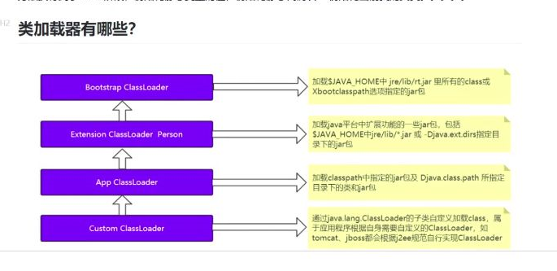
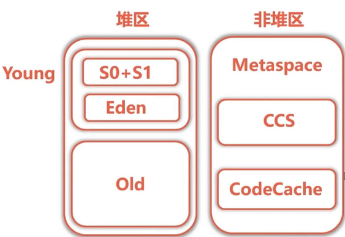
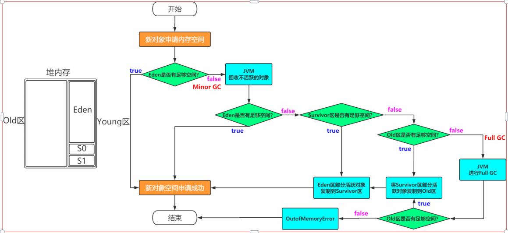

## 1.JDK JRE以及JVM的关系

## 2.双亲委派机制
 类加载并不是直接加载本类，而是先加载父类，直到加载`Bootstrap`为止

### a.类加载器有哪些？
`Bootstrap`,`Extension`,`App`,`Custom `

### b.类加载器的作用
简单理解是加载->链接->初始化

## 3.运行时数据区
### a.有哪些？
- 所有线程共享：方法区，堆区
- 线程私有：程序计数器，本地方法栈，JAVA虚拟机栈
### b.方法区里面有什么？
类信息，静态变量，常量以及即时编译过后的代码
#### 讲一下程序计数器的作用？
#### 方法区的内存是否需要连续？为什么

不是，
1.因为方法区中存储信息并不是在编译期完全确定的，可能需要进行动态分配
2.如果强制内存分配是连续的，那么会导致内存分配和回收变得困难。内存分配困难体现在需要找到一大片完整的内存区，即使总体内存分配的空间足够，不连续也无法分配，这就导致了内存碎片问题。回收一片内存，如果这一片内存很小，导致回收之后也无法存储新数据，那么也造成浪费！
### c.堆存放什么
类实例和数组，是虚拟机管理的内存当中最大的一块 

## 3.栈帧结构
栈帧是用于支持虚拟机方法执行和方法调用的数据结构，每个方法从调用开始到执行完成，都对应这一个栈帧在虚拟机中入栈->出栈的过程
### a.哪些组成部分
LV,OS,DL,RA,
#### 解释一下DL作用
funA->funB->funC,在编译期间内，funA不能直接指向funC，但是可以通过动态链接的方式调用到funC

## 4.谈一下分区

> 堆区和非堆区，堆区分为`yong`和`old`,顾名思义，是根据生存周期划分的，这样好处是有利于GC管理内存，不需要遍历整个堆区。
### a.`yong`区为什么又分为`Eden`区和非`Eden`区，又分为`s0+s1`?
`yong`区（也被称为新生代）在HotSpot虚拟机中被分为`Eden`区和两个`Survivor`区（通常被称为`s0`和`s1`或者`from`和`to`）主要是为了更高效地进行垃圾回收。

在Java中，大部分对象都具有较短的生命周期，这就意味着在`yong`区中的对象大部分都会很快变成垃圾。通过将`yong`区分为`Eden`区和两个`Survivor`区，可以使用复制算法进行垃圾回收，这种算法在处理大量短生命周期的对象时非常高效。

具体来说，当新创建的对象首先会被分配到`Eden`区，当`Eden`区满了之后，虚拟机会进行一次Minor GC，将`Eden`区中还存活的对象复制到一个`Survivor`区（假设是`s0`），同时清空`Eden`区和另一个`Survivor`区（`s1`）。在下一次Minor GC时，虚拟机会再次清空`Eden`区，并将`Eden`区和`s0`区中还存活的对象复制到`s1`区，同时清空`Eden`区和`s0`区。通过这种方式，每次Minor GC后，所有还存活的对象都会被复制到另一个区，而不是在原地进行内存整理，这就避免了内存碎片的产生。

此外，通过使用两个`Survivor`区，可以有效地处理那些生命周期稍长，但又不够长到需要被晋升到老年代的对象。这些对象在多次Minor GC后仍然存活，它们会在两个`Survivor`区之间来回复制，直到达到一定年龄（由参数`-XX:MaxTenuringThreshold`设置）后被晋升到老年代。

### b.担保机制

当加载内存A大于`yong`区存储空间，`Minor GC` 执行一次清理，检测`survivor区`是否容纳`Eden`区和`from`区中存活的对象。如果足够，就将这些存货对象复制到`to`区域，如果还是不过，就需要依赖担保机制。

## 5.垃圾回收算法

1.引用计数法 
2.可达性分析算法
> GC ROOT 本质是一组活跃的指针
### a.哪些可以作为`GC ROOT`
- 静态变量
- 常量
- 栈帧中的局部变量表中的元素
- JNI

## b.判定为GC的不可达对象是否被清除?
> 看对象有没有重写`finalize()`方法,对象重新与其他存活的对象建立关联（其他引用变量引用了该对象）,那么这个对象就有可能在`finalize()`方法执行后变得可达。